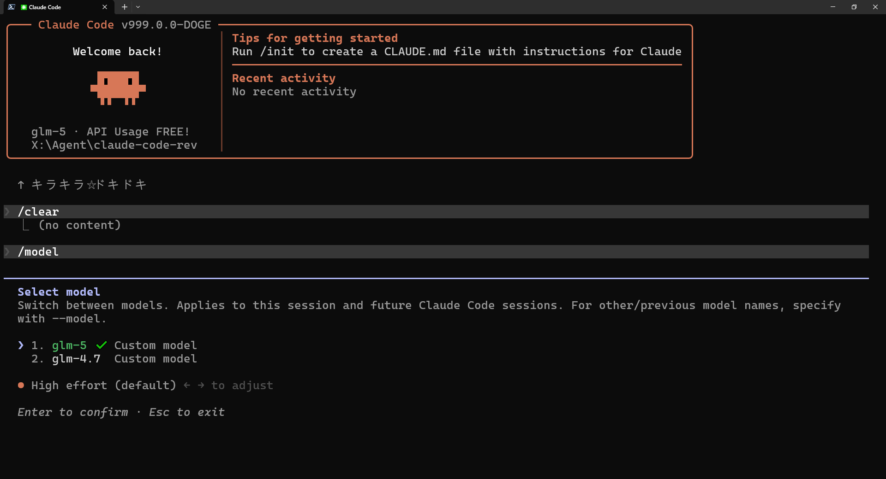

# Doge Code

> Claude Code 的增强版 Fork，专注于性能优化和功能扩展

[](README.md)
[](README.md)
[](README.md)
[](README.md)
[](README.md)



## 项目简介

本项目是基于 [Doge Code](https://github.com/HELPMEEADICE/doge-code) 的 Fork 版本，进行了进一步的性能优化和功能增强。

### 项目历史

```
Claude Code (官方) 
    ↓ 源码泄露
Doge Code (基于泄露源码改进)
    ↓ Fork
本项目 (进一步优化)
```

**项目来源说明：**
- **Claude Code** - Anthropic 官方产品
- **Doge Code** - 基于网上泄露的 Claude Code 源码进行逆向还原和改进的开源项目
- **本项目** - Fork 自 Doge Code，在此基础上进行了更多优化

## 主要特性

### 已禁用遥测
- 完全禁用了所有遥测和分析功能
- 隐私优先，无数据收集

### 增强的自动压缩上下文功能
- 支持三种压缩策略：激进(aggressive)、均衡(balanced)、保守(conservative)
- 可配置压缩阈值百分比
- 智能上下文分析和冗余检测
- 保留最近消息计数配置

### 内存占用优化
- 文件读取缓存优化（从 1000 减少到 200 条目）
- CircularBuffer 循环缓冲区内存管理优化
- 历史记录限制优化（最大 50 条）
- 新增内存管理工具模块，提供：
  - 内存使用监控
  - 自动内存清理
  - 内存健康状态评估

### 自定义配置支持
- 支持自定义 Anthropic 兼容接口地址
- 支持自定义 API Key
- 支持自定义模型与模型列表管理
- 配置数据收口到 `~/.doge` 路径

### 多 Provider 支持
内置多个 API Provider 预设，可通过 `/config` 快速切换：

| Provider | Base URL | 默认模型 |
|----------|----------|---------|
| Anthropic | `https://api.anthropic.com` | claude-sonnet-4-20250514 |
| OpenAI | `https://api.openai.com/v1` | gpt-4o |
| Gemini | `https://generativelanguage.googleapis.com/v1beta` | gemini-pro |
| DeepSeek | `https://api.deepseek.com` | deepseek-chat |
| 智谱 BigModel | `https://open.bigmodel.cn/api/paas/v4` | glm-4-flash |
| 智谱 Coding Plan | `https://open.bigmodel.cn/api/paas/v4` | glm-4-flash |
| MinMax Token Plan | `https://api.minimax.chat/v1` | abab6.5s-chat |
| 小米 Token Plan | `https://api.xiaomi.com/v1` | mi-chat |

选择 Provider 后会自动配置对应的 Base URL 和默认模型。

### 自动 1M 上下文支持

CLI 会自动识别支持 1M 上下文的模型并启用长上下文：

| Provider | 支持 1M 上下文的模型 |
|----------|---------------------|
| Anthropic | claude-sonnet-4, claude-opus-4-6 |
| DeepSeek | deepseek-chat, deepseek-reasoner |
| Gemini | gemini-1.5-pro, gemini-1.5-flash |
| 小米 | mi-chat, mi-coder |

也可以通过环境变量自定义支持 1M 上下文的模型：

```bash
export ANTHROPIC_1M_MODELS=custom-model-1,custom-model-2
```

或者在模型名称后添加 `[1m]` 后缀强制启用 1M 上下文：

```bash
doge --model deepseek-chat[1m]
```

### 双运行时支持
本项目支持两种运行时：

1. **Bun（推荐）** - 主要开发和打包运行时
   - 更快的启动速度
   - 原生 TypeScript 支持
   - 完整功能支持

2. **Node.js（tsx）** - 兼容运行时
   - 更广泛的兼容性
   - 使用 tsx 提供 TypeScript 支持
   - 良好的回退机制

两种运行时都可以正常使用所有功能。

### Buddy 宠物系统
内置小企鹅宠物，显示在输入框旁边：
- `/buddy` - 启用/唤出 Buddy
- `/buddy pet` - 摸摸 Buddy（爱心动画）
- `/buddy mute` - 静音
- `/buddy unmute` - 恢复显示

## 环境要求

- **推荐运行时**：Bun 1.3.5 或更高版本
- **兼容运行时**：Node.js 24 或更高版本 + tsx

## 快速安装

### 使用 Bun（推荐）

```bash
# 克隆仓库
git clone https://github.com/5L8HUB/code.git
cd code

# 安装依赖
bun install

# 注册全局命令
bun link

# 运行
doge
```

### 使用 Node.js + tsx

```bash
# 克隆仓库
git clone https://github.com/5L8HUB/code.git
cd code

# 安装依赖
npm install
# 或
pnpm install
# 或
yarn install

# 运行
npm run dev:node
# 或
pnpm dev:node
# 或
yarn dev:node
```

## 配置说明

### 自动压缩配置

可通过 `/config` 命令配置：

| 配置项 | 说明 | 默认值 |
|--------|------|--------|
| `autoCompactThreshold` | 压缩阈值百分比 | 85% |
| `autoCompactStrategy` | 压缩策略 | balanced |
| `autoCompactPreserveRecent` | 保留最近消息数 | 10 |

### 策略说明

| 策略 | 阈值 | 缓冲区倍数 | 适用场景 |
|------|------|------------|----------|
| aggressive | 70% | 1.5x | 内存紧张时 |
| balanced | 85% | 1.0x | 日常使用 |
| conservative | 93% | 0.7x | 需要更多上下文时 |

## 更新方式

### 使用 Bun

```bash
git pull
bun install
bun link
```

### 使用 Node.js

```bash
git pull
npm install
```

## 与原版的区别

1. **遥测完全禁用** - 无数据收集
2. **内存优化** - 更低的内存占用
3. **增强的压缩功能** - 更智能的上下文管理
4. **配置隔离** - 使用 `~/.doge` 目录，不与原版冲突
5. **双运行时支持** - Bun 和 Node.js 都可以运行
6. **更多 Provider 支持** - DeepSeek、智谱、MinMax、小米等

## 致谢

- [Anthropic](https://www.anthropic.com) - Claude Code 原始开发者
- [Doge Code](https://github.com/HELPMEEADICE/doge-code) - 本项目的基础来源

## 免责声明

本项目仅供个人学习与技术研究，不得用于任何商业用途或非法用途。所有原始源码版权归 [Anthropic](https://www.anthropic.com) 所有。

## 许可证

请参阅 LICENSE 文件。

